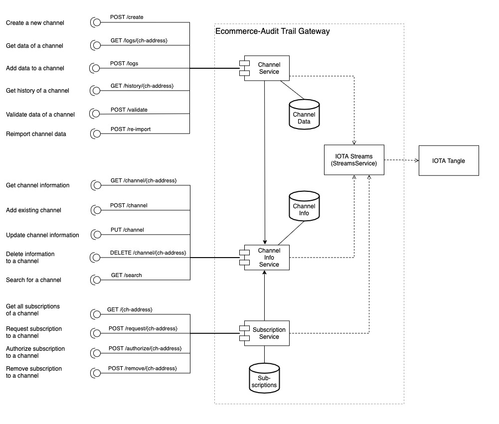

# Ecommerce-Audit Trail Gateway (GW)

The Ecommerce-Audit Trail Gateway allows users to create immutable data channels and share them with others. Channels data are stored onto the IOTA Tangle. A channels is implemented as IOTA Stream and can handle different Subscribers. <!-- really we call everything subscriber? --> <!-- these are the terms used by iota streams -->By requesting a subscription to a channel a so called subscriber can request `Read`, `Write`, `ReadAndWrite` access to the channel. This request must then be authorized by the creator (Author) of the channel. After a subscriber is authorized, it is then able to write/read to/from the channel. In addition to subscribers, the author can always read and write messages in the channel.

> __Important:__ In order to identify and authorise subscribers (being these individuals, organizations or objects), the Audit Trail GW currently integrates with the [Ecommerce-SSI bridge](./usage-ssi-bridge.md). __This means, everyone interacting with the audit trail needs to create its own identity before.__ See the corresponding documentation. The figure below shows a logic architecure with the integration of both IOTA Integration Services.
 

In case of the Audit Trail and the GW being deployed in presence of other (centralized) Accounting, Athentication and Authorization (AAA) systems this dependency will be removed (implementation will be provided during the project course).

## Ecommerce-Audit Trail GW APIs Definition
---

The list of provided APIs is shown in figure below. 
 

The Audit Trail GW implementation provides the following services:

__Channel Service__

The service allows to create new channels in the tangle. The identity creating the channel becomes the author of it and is able to read all messages and write data into the channel. Reading and writing from/to a channel is also offered by this service but subscribers need to be authorized before they are able to do so (see Subscription Service).

__Prefix:__ `/api/{{version}}/channels`

__Channel Info Service__

The service allows to search for one or more channels stored by the api. For instance the service could be used to query all channels created by a specific identity or with a specific topic. Furthermore it enables to maintain the channel in the database and also remove it. When removing the channel from the database the data won’t be removed from the ledger since the data is immutable but it is no more indexable at the api.

__Prefix:__ `/api/{{version}}/channel-info`

__Subscription Service__

The service allows to manage subscriptions to a specific channel. Identities can subscribe to a specific channel identified by a unique channel address. The author of the channel can then decide whether to authorize the identity to read or write from/to the channel. Authorized subscribers can also be revoked access to the channel afterwards. In addition this service can be used to list all authorized subscriptions to a channel.

__Prefix:__ `/api/{{version}}/subscription`

## Use Cases 
---
There are two scenarios in which the Audit Trail can be used in the context of e-commerce and the ENSURESEC project.

### 1. _Sharing immutable and auditable data/events._ 
This includes small amount of data that a channel Author and writer subscribers want to share with reader subscribers. All information is contained into the Audit Trail and its source (identity of the writer subscribers) can be verified. An example includes _sharing of threats information_ detected by a sensor on a critical e-commerce infrastructure and shared to alert all other systems connected to the same infrastructure.

The following workflow can be implemented:
* We assume a Company X identity has been registered and verified (see Ecommerce-SSI Bridge documentation); in addition an identity for employee Y and device (sensor) Z of Company X have also been registered and verified;
* In addition a Company A identity has been registered and verified, as well as the identity of an employee B and tool C of Company A have been registered and verified;
* The device Z uses the GW APIs to create a channel _a_;
* The tool C uses the GW APIs to search for channel (based on available indexing metadata) and to request subscription to the selected channel _a_;
* The device Z uses the GW APIs to authorize tool C to access the channel _a_ as reader;
* The device Z uses the GW APIs to add data to a channel _a_;
* The tool C is automatically notified of new data coming from device Z. <!-- not sure about this, I need to check-->

### 2. _Guaranteeing the immutability of large data sets._ 
This includes storing and sharing across organizations data sets maintained in large data lakes while guaranteeing that the data sets have not been altered over time or when passing across different parties. In this case Author and writer subscribers of a channel first index the data sets, then hash them and store the hash in the Audit Trail (using the GW APIs) on a channel registered with the created index and data set metadata. Authorised reader subscribers will receive the given data set and its index/metadata and will use them to retrieve and subscribed to the requested channel. Then they can compare the hash stored in the Audit Trail with the one generated from the received data set. 

An example of this includes storing on the Audit Trail hashes of data logs collected by e-commerce systems. This allows to perform forensic investigation in case of cyberphysical attacks to e-commerce infrastructure and to detect any tampering with such logs.

A similar workflow in the previous scenario can be implemented here. The exchange of data sets and the extraction of hash/their comparison shall be implemented by the client using the Audit Trail GW APIs.
